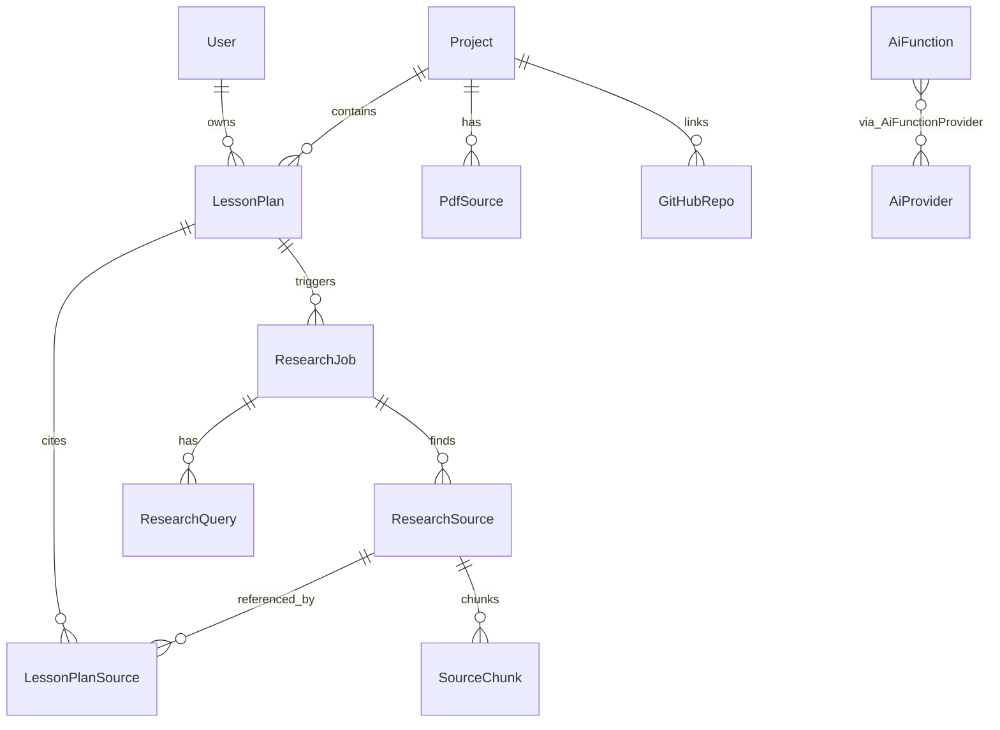

# Project Architecture and Feature Summary

## Lesson Plan PDF Builder

> **วัตถุประสงค์ของเอกสาร:** สรุปสถาปัตยกรรมและฟีเจอร์ของโปรเจกต์ เพื่อใช้เป็นข้อมูลอ้างอิงสำหรับการปรับโครงสร้างฐานข้อมูลและฟีเจอร์ให้สอดคล้องมาตรฐานแผนการสอน **อาชีวศึกษา (Vocational Education / สอศ.)**
>
> **ที่มา:** วิเคราะห์จาก source code จริงใน `lesson-plan-builder/` (อัปเดต: มิถุนายน 2026)
>
> **หมายเหตุสำคัญ:** โปรเจกต์นี้ใช้ **PostgreSQL** (ไม่ใช่ MySQL) ผ่าน **Prisma ORM**

---

## สารบัญ

1. [Tech Stack](#1-tech-stack)
2. [Database Schema](#2-database-schema)
3. [Core Features & Data Flow](#3-core-features--data-flow)
4. [Key Project Structure](#4-key-project-structure)
5. [Gap Analysis สำหรับอาชีวศึกษา](#5-gap-analysis-สำหรับอาชีวศึกษา)
6. [คำถามที่ต้องการคำแนะนำจาก AI](#6-คำถามที่ต้องการคำแนะนำจาก-ai)
7. [แบบฟอร์ม สอศ. (มาตรฐานอ้างอิง)](#7-แบบฟอร์ม-สอศ-มาตรฐานอ้างอิง)
8. [ตัวอย่างแผนการสอนอาชีวศึกษา](#8-ตัวอย่างแผนการสอนอาชีวศึกษา)
9. [Mapping: ระบบปัจจุบัน vs แบบฟอร์ม สอศ.](#9-mapping-ระบบปัจจุบัน-vs-แบบฟอร์ม-สอศ)

---

## 1. Tech Stack

| ชั้น (Layer) | เทคโนโลยี | เวอร์ชัน | รายละเอียด |
|---|---|---|---|
| **Frontend Framework** | Next.js (App Router) | 16.2.7 | React Server Components + Client Components |
| **UI Library** | React | 19.2.4 | |
| **Language** | TypeScript | 5.x | Strict mode |
| **Styling** | Tailwind CSS | 4.x | CSS variables, ฟอนต์ไทย Sarabun/Noto Sans Thai/Prompt |
| **UI Components** | shadcn/ui (radix-nova) | — | `components/ui/` |
| **Rich Text Editor** | TipTap | 3.26.0 | เก็บทั้ง HTML และ JSON |
| **Backend** | Next.js API Routes | — | `app/api/**/route.ts` (Node.js runtime) |
| **Database** | **PostgreSQL** | — | ผ่าน `DATABASE_URL` |
| **ORM** | **Prisma** | 7.8.0 | Client generate ไปที่ `lib/generated/prisma/` |
| **DB Driver** | `pg` + `@prisma/adapter-pg` | 8.21.0 / 7.8.0 | Connection pooling |
| **AI SDK** | Vercel AI SDK (`ai`) | 6.x | `generateObject()` structured output |
| **AI Providers** | OpenAI, Google Gemini, Anthropic, KIMI | — | Multi-provider + fallback จาก DB |
| **Validation** | Zod | 4.4.3 | API input/output schemas |
| **PDF Generation (หลัก)** | **Playwright (Chromium)** | 1.60.0 | Render หน้า preview แล้ว `page.pdf()` |
| **PDF Generation (รอง)** | `@react-pdf/renderer` | 4.5.1 | `LessonPlanPDF.tsx` — ไม่ได้ใช้ใน export หลัก |
| **PDF Parsing** | `pdf-parse` | 2.4.5 | ดึงข้อความจาก PDF ที่อัปโหลด |
| **OCR** | `tesseract.js` | 7.0.0 | สำหรับ PDF ที่ไม่มี text layer |
| **HTML Sanitization** | `sanitize-html` | 2.17.4 | ก่อนบันทึกลง DB |
| **GitHub Integration** | `@octokit/rest` | 22.0.1 | Push แผนการสอนไป repository |
| **Notifications** | `sonner` | 2.0.7 | Toast UI |

### การเชื่อมต่อฐานข้อมูล

```typescript
// lib/prisma.ts
PrismaClient + PrismaPg adapter + pg Pool
// datasource provider: postgresql (prisma/schema.prisma)
```

**ไม่มี MySQL schema ในโปรเจกต์นี้** — หากต้องการย้ายไป MySQL ต้องเปลี่ยน `datasource provider` ใน Prisma และปรับ adapter

### Environment Variables สำคัญ

| Variable | Required | Purpose |
|---|---|---|
| `DATABASE_URL` | Yes | PostgreSQL connection string |
| `OPENAI_API_KEY` | Yes (สำหรับ AI) | OpenAI API key |
| `NEXT_PUBLIC_APP_URL` | No | URL สำหรับ Playwright PDF export |

---

## 2. Database Schema

> **Source of Truth:** `prisma/schema.prisma`
>
> **หมายเหตุ:** เอกสาร `SCHEMA.md` และ `ARCHITECTURE.md` บางส่วนอธิบาย `LessonSection` model ที่ไม่มีใน Prisma จริง — ใช้ schema ด้านล่างเป็นหลัก

### 2.1 Entity Relationship Diagram



### 2.2 ตาราง `Project`

| คอลัมน์ | ประเภท | คำอธิบาย |
|---|---|---|
| `id` | String (cuid) | Primary Key |
| `name` | String | ชื่อโปรเจกต์ |
| `description` | String? | คำอธิบาย |
| `status` | String | default `"active"` |
| `createdAt` | DateTime | วันที่สร้าง |
| `updatedAt` | DateTime | วันที่แก้ไข |

**ความสัมพันธ์:**
- `1:N` → `LessonPlan`
- `1:N` → `PdfSource`
- `1:N` → `GitHubRepo`

### 2.3 ตาราง `LessonPlan` (แกนหลักของระบบ)

#### ข้อมูลพื้นฐาน (Metadata)

| คอลัมน์ | ประเภท | Required | คำอธิบาย |
|---|---|---|---|
| `id` | String (cuid) | PK | รหัสแผนการสอน |
| `teacherName` | String? | | ชื่อครูผู้สอน |
| `schoolName` | String? | | ชื่อโรงเรียน/สถานศึกษา |
| `subjectName` | String | ✓ | วิชา (code เช่น `mathematics`, `computer`) |
| `gradeLevel` | String | ✓ | ระดับชั้น (code เช่น `m1`, `voc1`) |
| `semester` | String | ✓ | ภาคเรียน |
| `academicYear` | String | ✓ | ปีการศึกษา |
| `lessonTitle` | String | ✓ | ชื่อหน่วย/บทเรียน |

#### ฟิลด์ AI Research (ยังใช้งานบางส่วน)

| คอลัมน์ | ประเภท | คำอธิบาย |
|---|---|---|
| `topic` | String? | หัวข้อสำหรับค้นคว้า |
| `durationMinutes` | Int? | ระยะเวลา (นาที) |
| `standards` | String? | มาตรฐานการเรียนรู้ (**มีใน schema แต่ยังไม่ integrate ใน UI/AI/PDF**) |

#### เนื้อหาแผนการสอน (Dual Storage Pattern)

ทุก section เก็บ **2 รูปแบบพร้อมกัน**:

| Section | HTML Field (`@db.Text`) | JSON Field (TipTap) | คำอธิบาย |
|---|---|---|---|
| วัตถุประสงค์ | `objectives` | `objectivesJson` | วัตถุประสงค์การเรียนรู้ |
| สาระ/แนวคิด | `keyConcepts` | `keyConceptsJson` | สาระสำคัญ/แนวคิดหลัก |
| กิจกรรม | `learningActivities` | `learningActivitiesJson` | กิจกรรมการเรียนรู้ |
| สื่อ | `mediaResources` | `mediaResourcesJson` | สื่อและแหล่งเรียนรู้ |
| ประเมินผล | `assessment` | `assessmentJson` | การวัดและประเมินผล |
| หมายเหตุ | `notes` | `notesJson` | หมายเหตุเพิ่มเติม |

- **HTML** → ใช้ render, preview, PDF export
- **TipTap JSON** → ใช้ restore editor state

#### สถานะและ Foreign Keys

| คอลัมน์ | ประเภท | คำอธิบาย |
|---|---|---|
| `status` | String | `draft`, `published`, `archived`, `completed` |
| `aiStatus` | Enum? | `DRAFT`, `FINAL`, `ARCHIVED` |
| `projectId` | String? | FK → `Project` (onDelete: SetNull) |
| `userId` | String? | FK → `User` |
| `createdAt` | DateTime | |
| `updatedAt` | DateTime | |

**Indexes:** `projectId`, `status`, `userId`

### 2.4 ตาราง AI Research Pipeline

#### `ResearchJob`

| คอลัมน์ | ประเภท | คำอธิบาย |
|---|---|---|
| `id` | String (cuid) | PK |
| `topic` | String | หัวข้อค้นคว้า |
| `subject` | String | วิชา |
| `gradeLevel` | String | ระดับชั้น |
| `status` | Enum | `PENDING`, `RUNNING`, `COMPLETED`, `FAILED` |
| `lessonPlanId` | String? | FK → `LessonPlan` |

#### `ResearchQuery`

| คอลัมน์ | ประเภท | คำอธิบาย |
|---|---|---|
| `id` | String (cuid) | PK |
| `researchJobId` | String | FK → `ResearchJob` |
| `query` | String | คำค้น |
| `platform` | String | `web`, `google`, `youtube`, `reddit` ฯลฯ |
| `status` | Enum | ResearchStatus |
| `resultsCount` | Int? | จำนวนผลลัพธ์ |

#### `ResearchSource`

| คอลัมน์ | ประเภท | คำอธิบาย |
|---|---|---|
| `id` | String (cuid) | PK |
| `researchJobId` | String? | FK → `ResearchJob` |
| `title` | String | ชื่อแหล่งข้อมูล |
| `url` | String (unique) | URL |
| `platform` | String | `web`, `youtube`, `social`, `academic` |
| `author` | String? | ผู้เขียน |
| `publishedAt` | DateTime? | วันที่เผยแพร่ |
| `snippet` | Text? | คำอธิบายสั้น |
| `fullText` | Text? | เนื้อหาเต็ม |
| `credibilityScore` | Float | คะแนนความน่าเชื่อถือ (0-100) |
| `relevanceScore` | Float | คะแนนความเกี่ยวข้อง (0-100) |
| `license` | String? | สัญญาอนุญาต |
| `language` | String | default `"th"` |

#### `SourceChunk` (RAG)

| คอลัมน์ | ประเภท | คำอธิบาย |
|---|---|---|
| `id` | String (cuid) | PK |
| `sourceId` | String | FK → `ResearchSource` |
| `content` | Text | เนื้อหา chunk |
| `summary` | Text? | สรุป |
| `embedding` | Json? | Vector embedding |

#### `LessonPlanSource` (Junction M:N)

| คอลัมน์ | ประเภท | คำอธิบาย |
|---|---|---|
| `id` | String (cuid) | PK |
| `lessonPlanId` | String | FK → `LessonPlan` |
| `sourceId` | String | FK → `ResearchSource` |
| `citationNote` | String? | หมายเหตุการอ้างอิง |

**Unique constraint:** `[lessonPlanId, sourceId]`

### 2.5 ตาราง AI Settings Center

#### `AiProvider`

| คอลัมน์ | ประเภท | คำอธิบาย |
|---|---|---|
| `id` | String (cuid) | PK |
| `key` | String (unique) | `openai`, `kimi`, `gemini`, `anthropic` |
| `name` | String | ชื่อแสดงผล |
| `type` | String | `openai-compatible`, `gemini-native` |
| `baseUrl` | String? | Custom endpoint |
| `apiKeyEnc` | Text? | API key (encrypted) |
| `model` | String | Default model |
| `settings` | Json? | Provider-specific config |
| `isEnabled` | Boolean | |
| `isDefault` | Boolean | Primary provider |
| `priority` | Int | Fallback ordering |

#### `AiFunction`

| คอลัมน์ | ประเภท | คำอธิบาย |
|---|---|---|
| `key` | String (unique) | `ai_helper`, `generate_lesson`, `research_automation` |
| `name` | String | ชื่อแสดงผล |
| `description` | Text? | |
| `category` | String | `content_generation`, `research`, `analysis` |
| `settings` | Json? | Function defaults |

#### `AiFunctionProvider` (M:N Junction)

| คอลัมน์ | ประเภท | คำอธิบาย |
|---|---|---|
| `functionId` | String | FK → `AiFunction` |
| `providerId` | String | FK → `AiProvider` |
| `priority` | Int | Priority สำหรับ function นี้ |
| `config` | Json? | temperature, maxTokens ฯลฯ |

### 2.6 ตารางสนับสนุนอื่น

#### `PdfSource`

| คอลัมน์ | ประเภท | คำอธิบาย |
|---|---|---|
| `id` | String (cuid) | PK |
| `filename` | String | ชื่อไฟล์ในระบบ (UUID) |
| `originalName` | String | ชื่อไฟล์ต้นฉบับ |
| `filePath` | String | path ใน `public/uploads/` |
| `fileSize` | Int | ขนาดไฟล์ (bytes) |
| `fileType` | String | MIME type |
| `pageCount` | Int? | จำนวนหน้า |
| `extractedText` | Text? | ข้อความที่ดึงได้ |
| `extractionStatus` | Enum | `PENDING`, `PROCESSING`, `COMPLETED`, `FAILED` |
| `extractionError` | String? | ข้อความ error |
| `projectId` | String | FK → `Project` |

#### `User`

| คอลัมน์ | ประเภท | คำอธิบาย |
|---|---|---|
| `id` | String (cuid) | PK |
| `email` | String (unique) | |
| `name` | String? | |

> **หมายเหตุ:** ยังไม่มี authentication system เต็มรูปแบบ

#### `AppSetting` (Singleton: `id = "default"`)

เก็บตั้งค่าผู้ใช้: ชื่อ, โรงเรียน, theme, fontSize, language, PDF defaults (pageSize, margin)

#### `GitHubIntegration` / `GitHubRepo`

เชื่อมต่อ GitHub token (encrypted) และ repository กับ Project

#### `SystemObjectRegistry`

ลงทะเบียน component, API route, Prisma model ในระบบ

#### `AuditLog`

บันทึก action: `ai_generate`, `export` พร้อม metadata

---

## 3. Core Features & Data Flow

### 3.1 Feature Overview

| ฟีเจอร์ | คำอธิบาย | Entry Point |
|---|---|---|
| **Dashboard** | สถิติ, แผนล่าสุด, quick actions | `/dashboard` |
| **สร้างแผนด้วยมือ** | ฟอร์ม + TipTap editor | `/dashboard/lesson-plans/new`, `/editor/[id]` |
| **AI Helper (ใน Editor)** | สร้างเนื้อหาบางส่วน ไม่บันทึกอัตโนมัติ | `AIHelperButton` → `/api/ai-generate` |
| **Lesson Builder (AI Workflow)** | ฟอร์ม → ค้นคว้า → สร้างแผน → บันทึก DB | `/dashboard/lesson-builder` |
| **AI Research** | ค้นหาแหล่งข้อมูลออนไลน์ | `/api/research/start` |
| **Generate Lesson** | สร้างแผนเต็มรูปแบบ + บันทึก DB | `/api/generate-lesson` |
| **PDF Upload/Extract** | อัปโหลด PDF → ดึงข้อความ → ใช้เป็น context AI | `/api/upload-pdf`, `/api/extract-pdf` |
| **Preview** | แสดงแผนรูปแบบ A4 | `/preview/[id]` |
| **PDF Export** | Playwright render → PDF file | `/api/export-pdf` |
| **GitHub Push** | ส่งแผนไป repository | `/api/github/push` |
| **AI Settings** | จัดการ provider/function | `/dashboard/settings` |

### 3.2 Data Flow: สร้างแผนด้วยมือ (Manual)

```
[ผู้ใช้กรอกฟอร์ม]
    ↓
LessonPlanForm (Client Component)
    ↓ TipTap Editor onChange
เก็บ state: { field: HTML string, fieldJson: JSONContent }
    ↓ คลิก "บันทึก"
POST/PUT /api/lesson-plans
    ↓ Zod validation
sanitizeRichText() ทุก HTML field
    ↓
prisma.lessonPlan.create/update
    ↓
PostgreSQL (LessonPlan table)
    ↓
[Preview] GET /api/lesson-plans/[id] → A4Preview
    ↓
[Export] POST /api/export-pdf → Playwright → public/exports/*.pdf
```

### 3.3 Data Flow: AI Helper (ใน Editor — ไม่บันทึกอัตโนมัติ)

```
[ผู้ใช้คลิก "ให้ AI ช่วยร่างแผนการสอน"]
    ↓
AIHelperButton รวบรวม: subject, grade, lessonTitle, duration, context
    ↓ (optional) researchJobId + useResearchSources
POST /api/ai-generate
    ↓
getResearchContext() — ดึง ResearchSource ที่ score ≥ 40
    ↓
System Prompt: "ครูผู้เชี่ยวชาญ...การศึกษาไทย" (ทั่วไป ไม่เฉพาะอาชีวศึกษา)
User Prompt: วิชา, ระดับชั้น, หัวข้อ, บริบท
    ↓
generateObjectWithProviderFallback({
  functionKey: "ai_helper",
  schema: lessonPlanContentSchema  // Zod structured output
})
    ↓
AI Response (JSON):
  - objectives[], keyConcepts[]
  - activities[{ phase: ก่อนเรียน|ขณะเรียน|หลังเรียน, title, description, duration }]
  - assessment[{ method, criteria, tool }]
  - mediaResources[], summary
    ↓
แปลง JSON → HTML (ul/li, h3 phases)
sanitizeRichText()
    ↓
Response → Client อัปเดต form state
    ↓
[ผู้ใช้ต้องกด Save เอง] → POST/PUT /api/lesson-plans
```

### 3.4 Data Flow: Lesson Builder (AI Workflow เต็มรูปแบบ)

```
Step 1: FORM
/dashboard/lesson-builder?projectId=xxx
LessonPlanForm → กรอก topic, subject, gradeLevel, duration, teacher, school
    ↓
Step 2: RESEARCH (optional)
POST /api/research/start { topic, subject, gradeLevel }
    ↓
สร้าง ResearchJob + ResearchQuery records
executeResearchJob() (async, fire-and-forget ใน request handler เดียวกัน)
    ↓
performSearch() → บันทึก ResearchSource + SourceChunk
    ↓
Frontend poll GET /api/research/status
    ↓
แสดง ResearchSourceTable — ผู้ใช้เลือก sources
    ↓
Step 3: GENERATE
POST /api/generate-lesson {
  topic, subject, gradeLevel, sourceIds[], projectId?
}
    ↓
(optional) getProjectPdfContextForAI() — ดึง extractedText จาก PdfSource
    ↓
formatSourcesForAI() + PDF context → referenceContext
    ↓
generateObjectWithProviderFallback({
  functionKey: "generate_lesson",
  schema: lessonContentSchema
})
    ↓
prisma.$transaction:
  - lessonPlan.create (HTML fields)
  - lessonPlanSource.create (เชื่อม research sources)
    ↓
Step 4: EDITOR
LessonPlanEditor — แก้ไข/บันทึก PUT /api/lesson-plans/[id]
    ↓
Step 5: EXPORT
PDFExportButton → POST /api/export-pdf
```

### 3.5 Data Flow: PDF Export

```
POST /api/export-pdf { lessonPlanId }
    ↓
prisma.lessonPlan.findUnique — ตรวจสอบว่ามีแผน
    ↓
Playwright chromium.launch()
    ↓
page.goto(`${NEXT_PUBLIC_APP_URL}/preview/${lessonPlanId}`)
    ↓
A4Preview render HTML จาก LessonPlan fields
  - ฟอนต์ไทย: Noto Sans Thai, Sarabun, Prompt
  - Sections:
    1. วัตถุประสงค์การเรียนรู้
    2. สาระการเรียนรู้ / แนวคิดสำคัญ
    3. กระบวนการจัดการเรียนรู้
    4. สื่อและแหล่งเรียนรู้
    5. การวัดและประเมินผล
    6. หมายเหตุ (ถ้ามี)
    ↓
page.pdf({ format: "A4", printBackground: true })
    ↓
บันทึก → public/exports/lesson-plan_{title}_{timestamp}.pdf
    ↓
Response { downloadUrl: "/exports/..." }
```

### 3.6 AI Output Schema (Structured Generation)

#### `/api/ai-generate` — Zod Schema

```typescript
{
  objectives: string[],           // วัตถุประสงค์ 3-5 ข้อ
  keyConcepts: string[],          // สาระสำคัญ 3-5 ข้อ
  activities: [{
    phase: "ก่อนเรียน" | "ขณะเรียน" | "หลังเรียน",
    title: string,
    description: string,
    duration: string
  }],
  assessment: [{
    method: string,
    criteria: string,
    tool: string
  }],
  summary: string,
  mediaResources: string[]
}
```

#### `/api/generate-lesson` — Zod Schema

```typescript
{
  lessonTitle: string,
  objectives: string[],
  keyConcepts: string[],
  learningActivities: [{
    phase: "ก่อนเรียน" | "ขณะเรียน" | "หลังเรียน",
    title: string,
    description: string,
    durationMinutes: number
  }],
  assessment: [{ method, criteria, tool }],
  mediaResources: string[],
  notes: string
}
```

> **สำคัญ:** ทั้งสอง path แปลง AI JSON → HTML ก่อนบันทึก — **ไม่เก็บ raw AI JSON ใน DB**

### 3.7 System Prompt ปัจจุบัน

```
คุณเป็นครูผู้เชี่ยวชาญในการจัดทำแผนการสอนสำหรับการศึกษาไทย
โปรดสร้างเนื้อหาแผนการสอนที่ครบถ้วนและสมบูรณ์ โดยใช้ภาษาไทยที่ถูกต้องเหมาะสมกับการศึกษา

กฎการสร้างเนื้อหา:
1. วัตถุประสงค์ต้องวัดผลได้ ใช้กริยาดีเด่น (อธิบาย, วิเคราะห์, สร้าง, เปรียบเทียบ ฯลฯ)
2. กิจกรรมต้องสอดคล้องกับวัตถุประสงค์ และแบ่งเป็นขั้นตอนที่ชัดเจน
3. การประเมินผลต้องสอดคล้องกับวัตถุประสงค์และกิจกรรม
4. เนื้อหาต้องเหมาะสมกับระดับชั้นและวิชาที่ระบุ
5. หากมีข้อมูลอ้างอิง ให้นำมาใช้เพื่อสร้างเนื้อหาที่มีคุณภาพและอ้างอิงถูกต้อง
```

**ไม่มีการระบุ:** อาชีวศึกษา, ปวช./ปวส., สมรรถนะ, การเรียนรู้แบบผสมผสานทฤษฎี-ปฏิบัติ

### 3.8 ระดับการศึกษาที่รองรับใน Code

#### ใน UI Forms (ใช้งานจริง) — `components/editor/LessonPlanForm.tsx`, `components/lesson-builder/LessonPlanForm.tsx`

- ประถมศึกษา ป.1–ป.6
- มัธยมศึกษา ม.1–ม.6
- **ไม่มี ปวช./ปวส. ใน dropdown หลัก**

#### ใน `src/data/education-levels.ts` (มีแต่ยังไม่ integrate)

| Group | Levels |
|---|---|
| ประถมศึกษา | ป.1–ป.6 |
| มัธยมศึกษา | ม.1–ม.6 |
| **อาชีวศึกษา** | ปวช.1–3, ปวส.1–2 |
| อุดมศึกษา | ปี 1–4 |

#### ใน `src/data/ai-departments.ts` (ยังไม่ผูก DB)

แผนก/สาขา: เทคโนโลยีสารสนเทศ, คอมพิวเตอร์ธุรกิจ, วิทยาการคอมพิวเตอร์, วิศวกรรมคอมพิวเตอร์, เทคโนโลยีดิจิทัล, ธุรกิจดิจิทัล, หุ่นยนต์, การตลาดดิจิทัล, การจัดการธุรกิจ, การศึกษาและนวัตกรรม

---

## 4. Key Project Structure

```
lesson-plan-builder/
├── app/
│   ├── (main)/
│   │   ├── editor/[id]/page.tsx      # Editor route ทางเลือก
│   │   └── preview/[id]/page.tsx     # Preview สำหรับ PDF export (Playwright)
│   ├── dashboard/
│   │   ├── layout.tsx                # Sidebar + Topbar shell
│   │   ├── page.tsx                  # Dashboard home
│   │   ├── lesson-plans/             # รายการ/สร้าง/แก้ไข/พรีวิว
│   │   │   ├── page.tsx
│   │   │   ├── new/page.tsx
│   │   │   └── [id]/edit/page.tsx
│   │   │   └── [id]/preview/page.tsx
│   │   ├── lesson-builder/page.tsx   # AI Workflow หลัก (3 steps)
│   │   ├── projects/                 # จัดการ Project + PDF
│   │   ├── upload/                   # อัปโหลดไฟล์
│   │   └── settings/                 # ตั้งค่าแอป + AI
│   └── api/
│       ├── lesson-plans/             # CRUD แผนการสอน
│       │   ├── route.ts              # GET (list), POST (create)
│       │   └── [id]/route.ts         # GET, PUT, DELETE
│       ├── ai-generate/route.ts      # AI Helper (partial content)
│       ├── generate-lesson/route.ts  # AI Full lesson + DB save
│       ├── research/                 # start, status, sources, extract
│       ├── export-pdf/route.ts       # Playwright PDF generation
│       ├── upload-pdf/route.ts       # PDF upload
│       ├── extract-pdf/route.ts      # PDF text extraction
│       ├── ai/                       # settings, functions, providers
│       └── github/                   # auth, repo, push, status
│
├── components/
│   ├── lesson-builder/               # Lesson Builder workflow UI
│   │   ├── LessonPlanForm.tsx        # Step 1: ฟอร์มข้อมูลพื้นฐาน
│   │   ├── ResearchJobPanel.tsx      # Step 2: สถานะการค้นคว้า
│   │   ├── ResearchSourceTable.tsx   # Step 2: เลือกแหล่งข้อมูล
│   │   └── LessonPlanEditor.tsx      # Step 3: แก้ไขแผนที่สร้างแล้ว
│   ├── editor/
│   │   ├── LessonPlanForm.tsx        # Full editor (manual + AI tab + research)
│   │   ├── TiptapEditor.tsx          # Rich text component
│   │   └── EditorWizard.tsx          # Multi-step wizard UI
│   ├── ai/
│   │   ├── AIHelperButton.tsx        # In-editor AI generation trigger
│   │   ├── AIProvidersSettings.tsx   # Provider config UI
│   │   └── AIFunctionsSettings.tsx   # Function config UI
│   ├── preview/
│   │   ├── A4Preview.tsx             # A4 layout (PDF source of truth)
│   │   ├── PreviewToolbar.tsx        # Toolbar พรีวิว
│   │   └── a4-styles.css             # Print styles
│   ├── pdf/
│   │   ├── LessonPlanPDF.tsx         # @react-pdf/renderer (legacy, ไม่ใช้ใน export หลัก)
│   │   └── PDFExportButton.tsx       # Export trigger UI
│   └── research/
│       ├── ResearchPanel.tsx         # Research tab ใน editor
│       ├── SourceCard.tsx
│       └── SourceList.tsx
│
├── lib/
│   ├── prisma.ts                     # DB connection (PostgreSQL + pg Pool)
│   ├── generated/prisma/             # Auto-generated Prisma client
│   ├── ai/
│   │   ├── provider.ts               # AI model resolution + fallback
│   │   ├── settings-provider.ts      # DB-backed provider config
│   │   ├── generate-with-fallback.ts # Multi-provider generation
│   │   ├── normalize-lesson-json.ts  # AI response normalization
│   │   └── parse-json-response.ts
│   ├── research/
│   │   ├── search.ts                 # Search query generation
│   │   ├── research-agent.ts         # Research orchestration
│   │   ├── scorer.ts                 # Credibility/relevance scoring
│   │   ├── chunk.ts                  # Text chunking for RAG
│   │   └── citations.ts              # Citation formatting
│   ├── services/
│   │   ├── pdf-extraction.ts         # PDF parse + OCR
│   │   └── project-pdf-context.ts    # PDF context สำหรับ AI
│   ├── sanitize-html.ts              # HTML sanitization
│   ├── rate-limit.ts                 # In-memory rate limiting
│   └── audit-log.ts                  # Audit logging
│
├── prisma/
│   └── schema.prisma                 # Database schema (SOURCE OF TRUTH)
│
└── src/data/
    ├── education-levels.ts           # ระดับการศึกษา รวม ปวช./ปวส.
    ├── ai-departments.ts             # แผนก/สาขา (ยังไม่ผูก DB)
    └── sample-lesson-plans.ts        # ข้อมูลตัวอย่าง
```

### 4.1 ไฟล์สำคัญต่อการ Restructure อาชีวศึกษา

| ไฟล์ | บทบาท |
|---|---|
| `prisma/schema.prisma` | เพิ่มฟิลด์/ตารางมาตรฐานอาชีวศึกษา |
| `app/api/ai-generate/route.ts` | ปรับ system prompt + output Zod schema |
| `app/api/generate-lesson/route.ts` | ปรับ schema + การบันทึกฟิลด์ใหม่ |
| `components/preview/A4Preview.tsx` | ปรับ layout PDF ให้ตรงแบบฟอร์ม สอศ. |
| `components/preview/a4-styles.css` | สไตล์พิมพ์ A4 |
| `components/editor/LessonPlanForm.tsx` | เพิ่มฟิลด์ UI สำหรับอาชีวศึกษา |
| `components/lesson-builder/LessonPlanForm.tsx` | ปรับ grade/subject/department options |
| `src/data/education-levels.ts` | มี voc levels แล้ว — ต้อง integrate |
| `src/data/ai-departments.ts` | แผนก/สาขา — ต้อง integrate |
| `lib/ai/normalize-lesson-json.ts` | Normalize AI output ฟิลด์ใหม่ |

### 4.2 Route Map

| Route | ประเภท | หน้าที่ |
|---|---|---|
| `/dashboard` | Server Component | แดชบอร์ด |
| `/dashboard/lesson-plans` | Server Component | รายการแผน |
| `/dashboard/lesson-plans/new` | Client | สร้างแผนใหม่ |
| `/dashboard/lesson-plans/[id]/edit` | Client | แก้ไขแผน |
| `/dashboard/lesson-plans/[id]/preview` | Client | พรีวิว |
| `/dashboard/lesson-builder` | Client | AI workflow (form → research → generate → edit) |
| `/dashboard/projects` | Server Component | จัดการโปรเจกต์ |
| `/dashboard/projects/[id]` | Server Component | รายละเอียดโปรเจกต์ + PDF |
| `/editor/[id]` | Client | Editor ทางเลือก |
| `/preview/[id]` | Client | Preview สำหรับ Playwright PDF export |

### 4.3 API Endpoints สรุป

| Method | Endpoint | หน้าที่ |
|---|---|---|
| GET/POST | `/api/lesson-plans` | รายการ/สร้างแผน |
| GET/PUT/DELETE | `/api/lesson-plans/[id]` | อ่าน/แก้ไข/ลบแผน |
| POST | `/api/ai-generate` | AI Helper (ไม่บันทึก DB) |
| POST | `/api/generate-lesson` | AI สร้างแผนเต็ม + บันทึก DB |
| POST | `/api/research/start` | เริ่มงานค้นคว้า |
| GET | `/api/research/status` | สถานะงานค้นคว้า |
| GET | `/api/research/sources` | แหล่งข้อมูลที่พบ |
| POST | `/api/export-pdf` | สร้าง PDF ด้วย Playwright |
| POST | `/api/upload-pdf` | อัปโหลด PDF |
| POST | `/api/extract-pdf` | ดึงข้อความจาก PDF |

---

## 5. Gap Analysis สำหรับอาชีวศึกษา

### 5.1 โครงสร้างแผนปัจจุบัน (6 Sections)

| # | Section ในระบบ | ฟิลด์ DB | แสดงใน PDF |
|---|---|---|---|
| 1 | วัตถุประสงค์การเรียนรู้ | `objectives` | ✓ |
| 2 | สาระการเรียนรู้ / แนวคิดสำคัญ | `keyConcepts` | ✓ |
| 3 | กระบวนการจัดการเรียนรู้ | `learningActivities` | ✓ |
| 4 | สื่อและแหล่งเรียนรู้ | `mediaResources` | ✓ |
| 5 | การวัดและประเมินผล | `assessment` | ✓ |
| 6 | หมายเหตุ | `notes` | ✓ (ถ้ามี) |

### 5.2 ฟิลด์ที่มาตรฐานอาชีวศึกษามักต้องการ แต่ยังไม่มี

| หมวด | ฟิลด์ที่ขาด | หมายเหตุ |
|---|---|---|
| **ข้อมูลหลักสูตร** | รหัสรายวิชา, ชื่อรายวิชาเต็ม, หน่วยกิต, ชั่วโมงทฤษฎี/ปฏิบัติ | |
| **สาขาวิชา** | แผนก/สาขา (Department/Program) | มีใน `ai-departments.ts` แต่ไม่ผูก DB |
| **มาตรฐาน** | มาตรฐานสมรรถนะ, ตัวชี้วัด, ผลลัพธ์การเรียนรู้ (CLO) | มี `standards` field แต่ไม่ใช้งาน |
| **กิจกรรม** | กิจกรรมในห้องปฏิบัติการ/Workshop, การฝึกปฏิบัติ | รวมอยู่ใน `learningActivities` เป็น HTML ทั่วไป |
| **อุปกรณ์** | เครื่องมือ, อุปกรณ์, วัสดุสิ้นเปลือง | |
| **ความปลอดภัย** | ข้อปฏิบัติด้านความปลอดภัยในห้องปฏิบัติการ | |
| **การประเมิน** | การประเมินสมรรถนะ (Performance Assessment), Rubric | รวมอยู่ใน `assessment` ทั่วไป |
| **สื่อ** | สื่อการเรียนรู้เฉพาะทาง (simulator, mock-up) | |
| **ระดับชั้น** | ปวช./ปวส. แยกชัดเจน | มีใน data file แต่ไม่ใน UI |

### 5.3 จุดแข็งของระบบปัจจุบัน

- AI pipeline ครบ: research → generate → edit → export
- Dual storage (HTML + TipTap JSON) ยืดหยุ่นสำหรับ rich content
- Multi-provider AI พร้อม fallback (OpenAI, Gemini, Anthropic, KIMI)
- PDF export รองรับฟอนต์ไทยผ่าน Playwright + web fonts
- มีข้อมูลระดับ ปวช./ปวส. และแผนกใน `src/data/` แล้ว
- Project-based workflow รองรับ PDF context สำหรับ AI
- Research pipeline พร้อม citation และ scoring

### 5.4 จุดอ่อน / Technical Debt

- Schema เป็น flat Text fields — ยากต่อการ query/validate โครงสร้างซับซ้อน
- ไม่เก็บ raw AI JSON — ยากต่อการ re-process หรือ migrate
- `SCHEMA.md` / `ARCHITECTURE.md` ไม่ sync กับ Prisma จริง
- ไม่มี authentication/authorization
- Research รัน fire-and-forget ใน API handler — ไม่มี worker queue
- `@react-pdf/renderer` component มีแต่ไม่ได้ใช้ใน export หลัก

---

## 6. คำถามที่ต้องการคำแนะนำจาก AI

> ใช้ส่วนนี้เป็น prompt สำหรับ [Google Gemini](https://gemini.google.com/) หรือ AI assistant อื่น

### บริบท

ฉันมี web app **Lesson Plan PDF Builder** (Next.js + PostgreSQL + Prisma + AI) ที่ออกแบบมาสำหรับครูไทยทั่วไป ต้องการปรับให้รองรับมาตรฐานแผนการสอน **อาชีวศึกษา (ปวช./ปวส.)** ตามแนว สอศ./กระทรวงศึกษาธิการ

### คำถามหลัก

1. **Database Schema:** ควรเพิ่มตาราง/ฟิลด์อะไรบ้างใน `LessonPlan` เพื่อรองรับมาตรฐานอาชีวศึกษา? ควรใช้ flat fields ต่อ หรือ normalize เป็นตาราง `LessonPlanSection`, `CompetencyStandard`, `VocationalProgram`?

2. **AI Generation:** ควรปรับ Zod schema และ system prompt อย่างไรให้สร้างแผนที่มี: ชั่วโมงทฤษฎี/ปฏิบัติ, กิจกรรมห้องปฏิบัติการ, มาตรฐานสมรรถนะ, การประเมินสมรรถนะ?

3. **PDF Template:** โครงสร้าง section ใน `A4Preview` ควรเปลี่ยนเป็นแบบฟอร์มอาชีวศึกษาอย่างไร? ควรรองรับ template หลายแบบ (ทั่วไป vs อาชีวศึกษา)?

4. **Migration Strategy:** แผนการสอนเดิมที่มีอยู่ใน DB จะ migrate อย่างไรเมื่อเปลี่ยน schema?

5. **Education Levels:** ควร integrate `education-levels.ts` (ปวช./ปวส.) เข้า DB หรือใช้ enum/config file?

### ข้อจำกัด

- ต้องใช้ PostgreSQL + Prisma (ไม่เปลี่ยนเป็น MySQL)
- ต้องรักษา backward compatibility กับแผนเดิม
- PDF export ใช้ Playwright render จาก `A4Preview` (ไม่ใช้ @react-pdf/renderer)
- เนื้อหาเก็บทั้ง HTML และ TipTap JSON

### สิ่งที่ต้องการเป็น Output

1. Proposed Prisma schema (พร้อม migration plan)
2. Proposed AI Zod schema สำหรับอาชีวศึกษา
3. Proposed PDF section structure
4. Implementation priority (Phase 1-3)

---

## 7. แบบฟอร์ม สอศ. (มาตรฐานอ้างอิง)

> **แหล่งอ้างอิงหลัก:** คู่มือการจัดทำแผนการจัดการเรียนรู้มุ่งเน้นสมรรถนะ — สำนักงานคณะกรรมการการอาชีวศึกษา (สอศ.) กระทรวงศึกษาธิการ
>
> - [คู่มือ สอศ. (PDF)](http://www.svc.ac.th/th/images/Files/2561/Manual02.pdf)
> - [ดาวน์โหลดแบบฟอร์ม — วิทยาลัยตัวอย่าง](http://www.nyc.ac.th/index.php/%E0%B8%94%E0%B8%B2%E0%B8%A7%E0%B8%99%E0%B9%8C%E0%B9%82%E0%B8%AB%E0%B8%A5%E0%B8%94%E0%B9%81%E0%B8%9A%E0%B8%9A%E0%B8%9F%E0%B8%AD%E0%B8%A3%E0%B9%8C%E0%B8%A1)

### 7.1 โครงสร้างเอกสารแผนการจัดการเรียนรู้ (ระดับรายวิชา)

แผนการจัดการเรียนรู้มุ่งเน้นสมรรถนะของ สอศ. แบ่งเป็น **3 ส่วนหลัก**:

| ส่วน | เนื้อหา | หมายเหตุ |
|---|---|---|
| **ส่วนที่ 1: ส่วนนำ** | ปก, คำนำ, สารบัญ, การวิเคราะห์หลักสูตร | ระดับรายวิชาทั้งภาค |
| **ส่วนที่ 2: ส่วนเนื้อหา** | แผนรายหน่วยการเรียนรู้ (รายชั่วโมง) | **แกนหลักที่ระบบต้องรองรับ** |
| **ส่วนที่ 3: ส่วนท้าย** | บันทึกหลังสอน, ใบงาน, แบบทดสอบ | เอกสารประกอบ |

### 7.2 ข้อมูลหลักสูตรรายวิชา (Course-Level Metadata)

ฟิลด์ที่ปรากฏในปกและหลักสูตรรายวิชา:

| ฟิลด์ | คำอธิบาย | ตัวอย่าง |
|---|---|---|
| `courseName` | ชื่อวิชา | พื้นฐานปัญญาประดิษฐ์ |
| `courseCode` | รหัสวิชา | 2000-1101 |
| `theoryHours` | ชั่วโมงทฤษฎี | 30 |
| `practiceHours` | ชั่วโมงปฏิบัติ | 30 |
| `creditUnits` | หน่วยกิต | 2 |
| `qualificationLevel` | ระดับประกาศนียบัตร | ปวช. / ปวส. |
| `subjectType` | ประเภทวิชา | วิชาพื้นฐาน / วิชาเฉพาะ |
| `fieldOfStudy` | สาขาวิชา | เทคโนโลยีสารสนเทศ |
| `fieldOfWork` | สาขางาน | งานคอมพิวเตอร์ |
| `institutionName` | สถานศึกษา | วิทยาลัย XXX |
| `preparedBy` | ผู้จัดทำ | อาจารย์ XXX |

### 7.3 หลักสูตรรายวิชา (Course Description Block)

ก่อนเข้าสู่แผนรายหน่วย ต้องมี:

| ลำดับ | หัวข้อ | คำอธิบาย |
|---|---|---|
| 1 | **จุดประสงค์รายวิชา** | คุณลักษณะ/ความสามารถหลังผ่านรายวิชา (จากหลักสูตร) |
| 2 | **สมรรถนะรายวิชา** | ความสามารถประยุกต์ใช้ ครอบคลุม 3 ด้าน: พุทธิพิสัย, ทักษะพิสัย, จิตพิสัย |
| 3 | **คำอธิบายรายวิชา** | สิ่งที่จะสอน (ทฤษฎี) หรืองานย่อย (ปฏิบัติ) |
| 4 | **ตารางหน่วยการเรียนรู้** | หน่วยที่, ชื่อหน่วย, จำนวนชั่วโมง, สัปดาห์ที่ |
| 5 | **หน่วยการเรียนรู้และสมรรถนะประจำหน่วย** | สมรรถนะแยก 3 ด้าน: ความรู้, ทักษะ, คุณลักษณะที่พึงประสงค์ |

### 7.4 แผนการจัดการเรียนรู้รายหน่วย (Unit Lesson Plan) — 10 หัวข้อหลัก

นี่คือโครงสร้างที่ **ระบบควรรองรับเป็นหลัก** สำหรับแต่ละหน่วย/ครั้งสอน:

| # | หัวข้อ สอศ. | รายละเอียดย่อย |
|---|---|---|
| **Header** | ชื่อหน่วย, สอนครั้งที่, ชั่วโมงรวม | Metadata ของหน่วย |
| **1** | สาระสำคัญ | ความคิดรวบยอดของเนื้อหาหน่วย |
| **2** | สมรรถนะประจำหน่วย | 2.1–2.4 ความสามารถที่ต้องเกิดขึ้น |
| **3** | จุดประสงค์การเรียนรู้ | **3.1 ด้านความรู้** (พุทธิพิสัย 6 ระดับ) |
| | | **3.2 ด้านทักษะ** (ทักษะพิสัย 5 ขั้น) |
| | | **3.3 คุณลักษณะที่พึงประสงค์** (จิตพิสัย 5 ระดับ) |
| **4** | เนื้อหาสาระการเรียนรู้ | Must Know / Should Know / Could Know |
| **5** | กิจกรรมการจัดการเรียนรู้ | **5.1 การนำเข้าสู่บทเรียน** (Motivation) |
| | | **5.2 การเรียนรู้** (Information + Application) |
| | | **5.3 การสรุป** (Progress) |
| | | **5.4 การวัดและประเมินผล** (ระหว่างกิจกรรม) |
| **6** | สื่อการเรียนรู้/แหล่งการเรียนรู้ | 6.1 สื่อสิ่งพิมพ์, 6.2 โสตทัศน์, 6.3 หุ่นจำลอง/ของจริง, 6.4 อื่นๆ |
| **7** | เอกสารประกอบการจัดการเรียนรู้ | ใบความรู้, ใบงาน, ใบมอบหมายงาน |
| **8** | การบูรณาการ/ความสัมพันธ์กับวิชาอื่น | การเชื่อมโยงข้ามวิชา |
| **9** | การวัดและประเมินผล | **9.1 ก่อนเรียน**, **9.2 ขณะเรียน**, **9.3 หลังเรียน** |
| **10** | บันทึกหลังสอน | 10.1 ผลการใช้แผน, 10.2 ผลการเรียนรู้, 10.3 แนวทางพัฒนา |

### 7.5 กระบวนการจัดการเรียนรู้ MIPP (ที่ สอศ. แนะนำ)

```
M — Motivation     (ขั้นสนใจ)     → 5.1 การนำเข้าสู่บทเรียน
I — Information    (ขั้นศึกษาข้อมูล) → 5.2 การเรียนรู้ (ทฤษฎี/สาธิต)
P — Application    (ขั้นพยายาม)   → 5.2 การเรียนรู้ (ฝึกปฏิบัติ)
P — Progress       (ขั้นสำเร็จผล) → 5.3 การสรุป
```

### 7.6 เอกสารประกอบการปฏิบัติ (สำคัญสำหรับอาชีวศึกษา)

| เอกสาร | ชื่ออังกฤษ | วัตถุประสงค์ |
|---|---|---|
| ใบปฏิบัติงาน | Operation Sheet | แนวทางการฝึกปฏิบัติ |
| ใบสั่งงาน | Job Sheet | คำสั่งปฏิบัติงานตามขั้นตอน (เน้นความปลอดภัย) |
| ใบมอบหมายงาน | Assignment Sheet | งานนอกเวลาเรียน |

### 7.7 นิยามศัพท์สำคัญ (สำหรับ AI Prompt)

| คำศัพท์ | ความหมาย |
|---|---|
| **พุทธิพิสัย** | ด้านความรู้ — จำ, เข้าใจ, นำไปใช้, วิเคราะห์, สังเคราะห์, ประเมินค่า |
| **ทักษะพิสัย** | ด้านทักษะ — เลียนแบบ, ทำตามแบบ, ทำถูกต้อง, ทำต่อเนื่อง, ทำเป็นธรรมชาติ |
| **จิตพิสัย** | ด้านคุณลักษณะ — รับรู้, ตอบสนอง, เห็นคุณค่า, จัดระบบคุณค่า, พัฒนาเป็นนิสัย |
| **สมรรถนะ** | ความสามารถประยุกต์ใช้ความรู้+ทักษะ+คุณลักษณะในการปฏิบัติงาน |
| **สาระสำคัญ** | ความคิดรวบยอดของเนื้อหาหน่วย |
| **Must/Should/Could Know** | ระดับความสำคัญของเนื้อหา |

---

## 8. ตัวอย่างแผนการสอนอาชีวศึกษา

> ตัวอย่างด้านล่างจัดรูปแบบตาม **แบบฟอร์ม สอศ.** โดยอิงจากข้อมูลใน `src/data/sample-ai-lesson-plans.ts` ของโปรเจกต์ และปรับให้ครบโครงสร้างมาตรฐาน

### 8.1 ตัวอย่างที่ 1: ปวช.1 — พื้นฐานปัญญาประดิษฐ์

#### ข้อมูลหลักสูตร

```yaml
courseName: "พื้นฐานปัญญาประดิษฐ์"
courseCode: "2000-1101"
qualificationLevel: "ปวช."
gradeLevel: "ปวช. ปีที่ 1"
fieldOfStudy: "เทคโนโลยีสารสนเทศ"
fieldOfWork: "งานคอมพิวเตอร์"
theoryHours: 2
practiceHours: 1
creditUnits: 0.5
semester: "1"
academicYear: "2569"
institutionName: "วิทยาลัยตัวอย่าง"
teacherName: "อาจารย์ผู้สอน"
```

#### แผนรายหน่วย: หน่วยที่ 1 — รู้จักปัญญาประดิษฐ์และการใช้งานในชีวิตประจำวัน

```yaml
unitNumber: 1
unitName: "รู้จักปัญญาประดิษฐ์และการใช้งานในชีวิตประจำวัน"
teachingSession: 1
totalHours: 3

# 1. สาระสำคัญ
keyConcepts: |
  ปัญญาประดิษฐ์ (AI) คือเทคโนโลยีที่ทำให้เครื่องจักรเรียนรู้ วิเคราะห์ และช่วยตัดสินใจ
  ผู้เรียนต้องเข้าใจความหมาย ประเภท และการประยุกต์ใช้ AI ในชีวิตประจำวันและอาชีพ

# 2. สมรรถนะประจำหน่วย
unitCompetencies:
  - "อธิบายความหมายและประเภทของ AI ได้"
  - "ยกตัวอย่างการใช้ AI ในชีวิตประจำวันและอาชีพได้"
  - "วิเคราะห์ข้อดีข้อจำกัดของ AI ได้อย่างมีวิจารณญาณ"

# 3. จุดประสงค์การเรียนรู้ (3 ด้าน)
learningObjectives:
  knowledge:  # 3.1 ด้านความรู้ (พุทธิพิสัย)
    - "อธิบายความหมายของปัญญาประดิษฐ์ได้"           # เข้าใจ
    - "เปรียบเทียบ AI กับระบบอัตโนมัติทั่วไปได้"      # วิเคราะห์
    - "วิเคราะห์ข้อดีข้อจำกัดของ AI ได้"             # ประเมินค่า
  skills:  # 3.2 ด้านทักษะ (ทักษะพิสัย)
    - "ยกตัวอย่าง AI รอบตัวได้อย่างถูกต้อง"          # ทำได้ถูกต้อง
    - "จัดกลุ่มประเภท AI ตามการใช้งานได้"            # ทำได้ต่อเนื่อง
  attitudes:  # 3.3 คุณลักษณะที่พึงประสงค์ (จิตพิสัย)
    - "มีจิตสำนึกในการใช้ AI อย่างรับผิดชอบ"
    - "ใฝ่เรียนรู้เทคโนโลยีใหม่"
    - "มีวินัยในการทำงานกลุ่ม"

# 4. เนื้อหาสาระการเรียนรู้
content:
  mustKnow:
    - "ความหมายของ AI"
    - "ประเภท AI เบื้องต้น (Narrow AI, Generative AI)"
    - "ตัวอย่าง AI ในชีวิตประจำวัน"
  shouldKnow:
    - "ประวัติการพัฒนา AI"
    - "AI ในสายงาน IT"
  couldKnow:
    - "แนวโน้ม AI ในอนาคต"

# 5. กิจกรรมการจัดการเรียนรู้ (MIPP)
activities:
  introduction:  # 5.1 การนำเข้าสู่บทเรียน (Motivation)
    duration: "15 นาที"
    description: |
      ครูแสดงวิดีโอ AI ในชีวิตประจำวัน (Siri, ChatGPT, ระบบแนะนำสินค้า)
      ถามคำถาม: "วันนี้คุณใช้ AI อะไรบ้าง?" เพื่อกระตุ้นความสนใจ
  learning:  # 5.2 การเรียนรู้
    information:  # ขั้นศึกษาข้อมูล
      duration: "60 นาที"
      description: |
        - บรรยายความหมายและประเภท AI พร้อมสไลด์
        - อภิปรายกลุ่ม: ยกตัวอย่าง AI รอบตัว 5 อย่าง
        - ทำใบงานวิเคราะห์ข้อดี-ข้อจำกัดของ AI
    application:  # ขั้นพยายาม
      duration: "60 นาที"
      description: |
        - ทดลองใช้ AI Chatbot (เช่น ChatGPT) ตามสถานการณ์ที่กำหนด
        - จัดกลุ่มนำเสนอผลการทดลอง
  summary:  # 5.3 การสรุป (Progress)
    duration: "15 นาที"
    description: |
      - สรุปเนื้อหาหลักร่วมกัน
      - ตอบคำถามท้ายบท
      - มอบหมายงาน: สำรวจ AI ในอาชีพที่สนใจ

# 6. สื่อการเรียนรู้/แหล่งการเรียนรู้
mediaResources:
  print: ["สไลด์ AI เบื้องต้น", "ใบงานวิเคราะห์ AI", "ใบความรู้"]
  audiovisual: ["วิดีโอ AI ในชีวิตประจำวัน"]
  models: []
  other: ["AI Chatbot (ChatGPT/Gemini)", "อินเทอร์เน็ต"]

# 7. เอกสารประกอบ
supportingDocuments:
  - "ใบความรู้: ความหมายและประเภท AI"
  - "ใบงาน: วิเคราะห์ข้อดี-ข้อจำกัด AI"
  - "ใบมอบหมายงาน: สำรวจ AI ในอาชีพ"

# 8. การบูรณาการ
integration: |
  เชื่อมโยงกับวิชาภาษาอังกฤษ (ศัพท์เทคนิค AI)
  เชื่อมโยงกับวิชาคุณธรรม (จริยธรรมการใช้ AI)

# 9. การวัดและประเมินผล
assessment:
  before:  # 9.1 ก่อนเรียน
    - method: "สอบถามความรู้เดิม"
      tool: "คำถามปลายเปิด"
  during:  # 9.2 ขณะเรียน
    - method: "สังเกตการมีส่วนร่วม"
      tool: "แบบบันทึกพฤติกรรม"
    - method: "ตรวจใบงาน"
      tool: "ใบงานวิเคราะห์"
  after:  # 9.3 หลังเรียน
    - method: "ประเมินการนำเสนอ"
      tool: "Rubrik การนำเสนอ"
    - method: "แบบทดสอบ"
      tool: "ข้อสอบ 10 ข้อ"

# 10. บันทึกหลังสอน (กรอกหลังสอนจริง)
postTeachingRecord:
  planEffectiveness: ""  # 10.1
  studentOutcomes: ""    # 10.2
  improvementPlan: ""    # 10.3
```

---

### 8.2 ตัวอย่างที่ 2: ปวส.2 — AI Chatbot Development (วิชาปฏิบัติ)

#### ข้อมูลหลักสูตร

```yaml
courseName: "AI Chatbot Development"
courseCode: "3020-2205"
qualificationLevel: "ปวส."
gradeLevel: "ปวส. ปีที่ 2"
fieldOfStudy: "คอมพิวเตอร์ธุรกิจ"
theoryHours: 2
practiceHours: 4
creditUnits: 2
totalHours: 6
```

#### แผนรายหน่วย: หน่วยที่ 3 — การพัฒนา AI Chatbot สำหรับบริการลูกค้า

```yaml
unitNumber: 3
unitName: "การพัฒนา AI Chatbot สำหรับบริการลูกค้า"
teachingSession: 1
totalHours: 6

keyConcepts: |
  Chatbot ใช้ตรรกะ บทสนทนา และ AI เพื่อตอบคำถามหรือให้บริการลูกค้า
  ผู้เรียนต้องออกแบบ Flow การสนทนาและสร้างต้นแบบ Chatbot ได้

unitCompetencies:
  - "อธิบายโครงสร้าง Chatbot ได้"
  - "ออกแบบบทสนทนา (Conversation Flow) ได้"
  - "สร้างต้นแบบ Chatbot และทดสอบการใช้งานได้"

learningObjectives:
  knowledge:
    - "อธิบายส่วนประกอบของ Chatbot ได้"
    - "เปรียบเทียบ Chatbot แบบ Rule-based กับ AI-based ได้"
  skills:
    - "ออกแบบ Flow คำถาม-คำตอบได้"
    - "สร้าง Bot ต้นแบบด้วย No-code Platform ได้"
    - "ทดสอบและแก้ไข Bot ตาม Feedback ได้"
  attitudes:
    - "มีจิตสาธารณะในการออกแบบบริการ"
    - "มุ่งมั่นในการพัฒนาทักษะ"

content:
  mustKnow:
    - "โครงสร้าง Chatbot (Intent, Entity, Response)"
    - "ขั้นตอนการออกแบบ Conversation Flow"
    - "การทดสอบ Chatbot"
  shouldKnow:
    - "API Integration เบื้องต้น"
  couldKnow:
    - "NLP และ Intent Recognition"

activities:
  introduction:
    duration: "30 นาที"
    description: "วิเคราะห์ Chatbot ตัวอย่าง (LINE OA, Messenger Bot) — ทดลองใช้งานและจดจุดแข็ง-จุดอ่อน"
  learning:
    information:
      duration: "90 นาที"
      description: "บรรยายโครงสร้าง Chatbot + สาธิตการออกแบบ Flow ด้วย Diagram"
    application:
      duration: "180 นาที"
      description: |
        - ออกแบบ Flow คำถาม-คำตอบสำหรับธุรกิจที่เลือก
        - สร้าง Bot ต้นแบบด้วย No-code Platform
        - ทดสอบกับเพื่อนในห้อง บันทึก Feedback
  summary:
    duration: "30 นาที"
    description: "นำเสนอ Bot ต้นแบบ + สรุปบทเรียน + มอบหมายปรับปรุง Bot"

mediaResources:
  print: ["Conversation Flow Template", "ใบสั่งงาน Job Sheet"]
  audiovisual: ["วิดีโอสาธิต Chatbot Platform"]
  models: ["ตัวอย่าง Chatbot สำเร็จรูป"]
  other: ["No-code Chatbot Platform", "คอมพิวเตอร์ห้องปฏิบัติการ"]

supportingDocuments:
  - "ใบปฏิบัติงาน (Operation Sheet): ขั้นตอนสร้าง Chatbot"
  - "ใบสั่งงาน (Job Sheet): สร้าง Bot ต้นแบบ"
  - "แบบทดสอบผู้ใช้ (User Testing Form)"

assessment:
  before:
    - method: "ตรวจสอบพื้นฐานการใช้คอมพิวเตอร์"
      tool: "แบบสอบถาม"
  during:
    - method: "สังเกตการปฏิบัติในห้องแล็บ"
      tool: "แบบประเมินทักษะปฏิบัติ"
    - method: "ตรวจ Flow Diagram"
      tool: "Rubrik การออกแบบ"
  after:
    - method: "ประเมินต้นแบบ Chatbot"
      tool: "Rubrik ชิ้นงาน (Functionality, UX, Completeness)"
    - method: "ผลทดสอบการใช้งาน"
      tool: "แบบทดสอบผู้ใช้"
```

---

### 8.3 ตัวอย่างที่ 3: ปวช.3 — Data Literacy (เชื่อมโยงกับระบบปัจจุบัน)

ตัวอย่างนี้แสดงว่า **ข้อมูลใน `sample-ai-lesson-plans.ts` ของโปรเจกต์** ยังไม่ครบมาตรฐาน สอศ.:

| ฟิลด์ในระบบปัจจุบัน | ค่าตัวอย่าง | ขาดอะไรเทียบ สอศ. |
|---|---|---|
| `lessonTitle` | ความเข้าใจข้อมูลสำหรับการใช้งาน AI | ไม่มี `courseCode`, `unitNumber` |
| `objectives` | 3 ข้อ (list) | ไม่แยก 3 ด้าน (ความรู้/ทักษะ/คุณลักษณะ) |
| `learningActivities` | 4 ข้อ (list) | ไม่แยก MIPP, ไม่ระบุชั่วโมง |
| `assessment` | 3 ข้อ (list) | ไม่แยก ก่อน/ขณะ/หลังเรียน |
| `mediaResources` | 3 ข้อ (list) | ไม่แยกประเภทสื่อ (6.1–6.4) |
| — | ไม่มี | `unitCompetencies`, `content tiers`, `supportingDocuments`, `postTeachingRecord` |

---

## 9. Mapping: ระบบปัจจุบัน vs แบบฟอร์ม สอศ.

### 9.1 ตารางเปรียบเทียบฟิลด์

| ฟิลด์ สอศ. | ฟิลด์ระบบปัจจุบัน | สถานะ | แนวทางปรับ |
|---|---|---|---|
| ชื่อวิชา | `subjectName` | ⚠️ ใช้ code | เพิ่ม `courseName` + แสดง label |
| รหัสวิชา | — | ❌ ไม่มี | เพิ่ม `courseCode` |
| ทฤษฎี/ปฏิบัติ/หน่วยกิต | — | ❌ ไม่มี | เพิ่ม `theoryHours`, `practiceHours`, `creditUnits` |
| สาขาวิชา/สาขางาน | — | ❌ ไม่มี | เพิ่ม `fieldOfStudy`, `fieldOfWork` (จาก `ai-departments.ts`) |
| ระดับ ปวช./ปวส. | `gradeLevel` | ⚠️ บางฟอร์มไม่มี | integrate `education-levels.ts` |
| ชื่อหน่วย | `lessonTitle` | ✓ ใช้ได้ | เพิ่ม `unitNumber` |
| สาระสำคัญ | `keyConcepts` | ✓ ใช้ได้ | — |
| สมรรถนะประจำหน่วย | — | ❌ ไม่มี | เพิ่ม `unitCompetencies` |
| จุดประสงค์ 3 ด้าน | `objectives` | ⚠️ รวมเป็นข้อเดียว | แยก `objectivesKnowledge`, `objectivesSkills`, `objectivesAttitudes` |
| เนื้อหา Must/Should/Could | — | ❌ ไม่มี | เพิ่ม `contentMustKnow`, `contentShouldKnow`, `contentCouldKnow` |
| กิจกรรม MIPP | `learningActivities` | ⚠️ ก่อน/ขณะ/หลังเรียน | ปรับเป็น MIPP + ระบุชั่วโมง |
| สื่อ 4 ประเภท | `mediaResources` | ⚠️ list เดียว | แยก `mediaPrint`, `mediaAV`, `mediaModels`, `mediaOther` |
| เอกสารประกอบ | — | ❌ ไม่มี | เพิ่ม `supportingDocuments` |
| การบูรณาการ | — | ❌ ไม่มี | เพิ่ม `integration` |
| ประเมิน 3 ช่วง | `assessment` | ⚠️ list เดียว | แยก `assessmentBefore`, `assessmentDuring`, `assessmentAfter` |
| บันทึกหลังสอน | `notes` | ⚠️ ใช้เป็น notes ทั่วไป | แยก `postTeachingRecord` |

### 9.2 สรุปความต่างเชิงโครงสร้าง

```
ระบบปัจจุบัน (6 sections):          แบบฟอร์ม สอศ. (10 sections + metadata):
┌─────────────────────────┐          ┌─────────────────────────────┐
│ 1. วัตถุประสงค์         │    →    │ 3. จุดประสงค์ (3 ด้าน)      │
│ 2. สาระ/แนวคิด          │    →    │ 1. สาระสำคัญ                │
│ 3. กิจกรรม (3 ขั้น)     │    →    │ 5. กิจกรรม (MIPP 4 ขั้น)     │
│ 4. สื่อ                  │    →    │ 6. สื่อ (4 ประเภท)           │
│ 5. ประเมินผล             │    →    │ 9. ประเมินผล (3 ช่วง)        │
│ 6. หมายเหตุ              │    →    │ 10. บันทึกหลังสอน            │
└─────────────────────────┘          │ + 2. สมรรถนะประจำหน่วย       │
                                     │ + 4. เนื้อหา (3 ระดับ)       │
                                     │ + 7. เอกสารประกอบ            │
                                     │ + 8. การบูรณาการ             │
                                     │ + Course metadata            │
                                     └─────────────────────────────┘
```

### 9.3 Proposed AI Zod Schema สำหรับอาชีวศึกษา (Draft)

```typescript
// Draft schema สำหรับ /api/generate-lesson (vocational mode)
const vocationalLessonSchema = z.object({
  // Unit metadata
  unitNumber: z.number().int().positive(),
  unitName: z.string(),
  teachingSession: z.number().int().positive(),
  totalHours: z.number().positive(),

  // Section 1-2
  keyConcepts: z.string(),
  unitCompetencies: z.array(z.string()).min(1).max(5),

  // Section 3: จุดประสงค์ 3 ด้าน
  objectives: z.object({
    knowledge: z.array(z.string()),   // พุทธิพิสัย
    skills: z.array(z.string()),      // ทักษะพิสัย
    attitudes: z.array(z.string()),   // จิตพิสัย
  }),

  // Section 4: เนื้อหา
  content: z.object({
    mustKnow: z.array(z.string()),
    shouldKnow: z.array(z.string()).optional(),
    couldKnow: z.array(z.string()).optional(),
  }),

  // Section 5: กิจกรรม MIPP
  activities: z.object({
    introduction: z.object({ duration: z.string(), description: z.string() }),
    learning: z.object({
      information: z.object({ duration: z.string(), description: z.string() }),
      application: z.object({ duration: z.string(), description: z.string() }),
    }),
    summary: z.object({ duration: z.string(), description: z.string() }),
  }),

  // Section 6-8
  mediaResources: z.object({
    print: z.array(z.string()),
    audiovisual: z.array(z.string()).optional(),
    models: z.array(z.string()).optional(),
    other: z.array(z.string()).optional(),
  }),
  supportingDocuments: z.array(z.string()),
  integration: z.string().optional(),

  // Section 9: ประเมิน 3 ช่วง
  assessment: z.object({
    before: z.array(z.object({ method: z.string(), tool: z.string() })),
    during: z.array(z.object({ method: z.string(), tool: z.string() })),
    after: z.array(z.object({ method: z.string(), tool: z.string() })),
  }),
});
```

---

## Appendix A: Prisma Schema ปัจจุบัน (LessonPlan Model)

```prisma
model LessonPlan {
  id                String             @id @default(cuid())
  
  // ข้อมูลพื้นฐาน
  teacherName       String?
  schoolName        String?
  subjectName       String
  gradeLevel        String
  semester          String
  academicYear      String
  lessonTitle       String
  
  // AI Research fields
  topic             String?
  durationMinutes   Int?
  standards         String?
  
  // เนื้อหา (Dual Storage: HTML + TipTap JSON)
  objectives        String             @db.Text
  objectivesJson    Json?
  keyConcepts       String             @db.Text
  keyConceptsJson   Json?
  learningActivities String            @db.Text
  learningActivitiesJson Json?
  mediaResources    String             @db.Text
  mediaResourcesJson Json?
  assessment        String             @db.Text
  assessmentJson    Json?
  notes             String?            @db.Text
  notesJson         Json?
  
  // Relations
  userId            String?
  user              User?              @relation(fields: [userId], references: [id])
  sources           LessonPlanSource[]
  researchJobs      ResearchJob[]
  projectId         String?
  project           Project?           @relation(fields: [projectId], references: [id], onDelete: SetNull)
  
  // Status
  status            String             @default("draft")
  aiStatus          LessonPlanStatus?  @default(DRAFT)
  
  createdAt         DateTime           @default(now())
  updatedAt         DateTime           @updatedAt
}
```

---

## Appendix B: ตัวอย่าง Prompt สำหรับ Gemini

```
ฉันแนบเอกสาร PROJECT_ARCHITECTURE_AND_FEATURE_SUMMARY.md ของโปรเจกต์ Lesson Plan PDF Builder
(รวมแบบฟอร์ม สอศ. มาตรฐานอ้างอิง + ตัวอย่างแผนอาชีวศึกษา 3 ชุด + Mapping ฟิลด์ + Draft Zod schema)

โปรดวิเคราะห์และเสนอ:
1. Prisma schema ใหม่ที่รองรับมาตรฐานแผนการสอนอาชีวศึกษาไทย (ปวช./ปวส.) ตาม Section 7-9
2. ปรับปรุง Draft AI Zod schema ใน Section 9.3 ให้สมบูรณ์
3. โครงสร้าง PDF template (A4Preview) ตาม 10 หัวข้อ สอศ.
4. แผน migration จาก schema เดิม (6 sections) → สอศ. (10 sections)
5. ลำดับความสำคัญการ implement (Phase 1-3)

ข้อจำกัด: PostgreSQL + Prisma, รักษา backward compatibility, PDF ใช้ Playwright + A4Preview
```

---

*เอกสารนี้สร้างโดย AI coding assistant จากการวิเคราะห์ source code จริง — มิถุนายน 2026*
